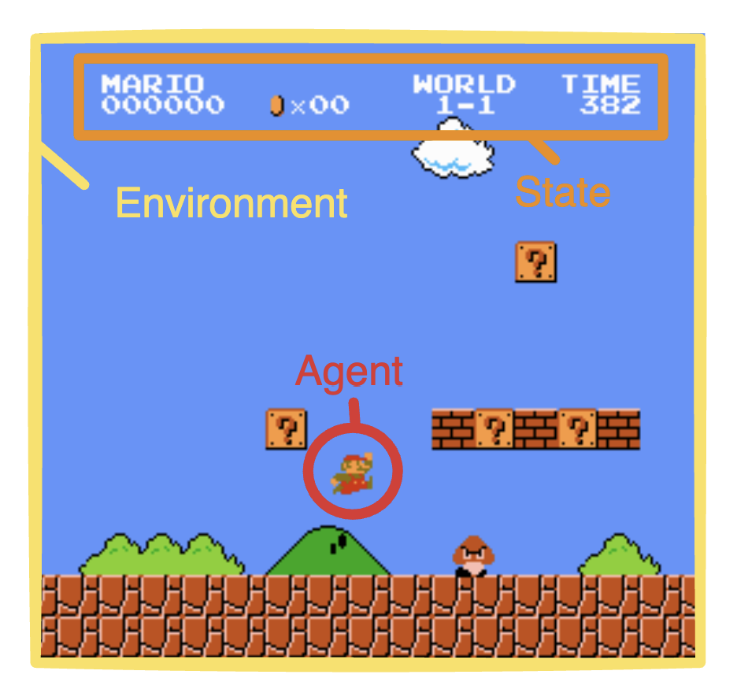
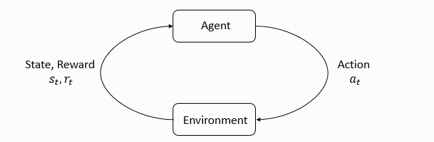

# Solving OpenAI Gymnasium Environments via Reinforcement Learning

Hi there 👋😃! This repo is a collection of RL algorithms implemented from scratch using PyTorch with the aim of solving a variety of environments from the Gymnasium library. Its purpose is to provide both a theoretical and practical understanding of the principles behind reinforcement learning to someone with little to no experience in machine learning 😎🤏 🕶️🤏 😉. 

I'm also writing a Medium series to go along with this repo that provides a more thorough, theoretical explanation of RL concepts. The README here is an abridged version of my Medium series - for a gentler introduction into RL, please check out my series :).

**Introduction to Reinforcement Learning:**
>[PART I: Reinforcement Learning & Markov Decision Processes]()<br>
*Estimated publication date: Sep 1 2024*

## Table of Contents 📓

1. [Introduction](#introduction)
    - [What is RL?](#what-is-rl)
    - [The Agent, State, and Environment](#the-agent-state-and-environment)
    - [Exploration vs. Exploitation](#exploration-vs-exploitation)
    - [The RL Problem](#the-rl-problem)
2. [Formal Definitions](#definitions)
    - [State, Action, and Reward](#state-action--reward)
    - [State-Value and Action-Value]()
    - [Policy Gradient Theorem]()
3. [Algorithms](#algorithms)
    - [Q-Learning](#q-learning)
    - [SARSA](#sarsa)
    - [Monte-Carlo Policy Gradient (REINFORCE)](#monte-carlo-policy-gradients-reinforce)
    - [DDQN](#ddqn)
    - [PPO](#ppo)
    - [Actor-Critic & A2C](#actor-critic--a2c)
4. [Conclusion]()
5. [References](#references)

## Usage

This guide is a series of self-contained modules implementing various RL algorithms from scratch. I plan to continuously update it with more algorithms once I finish implementing the current ones :). If you're interested in any algorithm in particular, I recommend going into the specific folder and looking through both the code and the readme. 

Each folder contains the `.py` implementation file of the algorithm in PyTorch, along with a README file covering the theory and higher-level description behind each algorithm. As of writing this, only REINFORCE is fully implemented, though more are in-progress :P.

All modules use OpenAI Gymnasium for training and testing. The official documentation for OpenAI Gymnasium can be found [here](). You can train each individual algorithm by running the python file, eg. 

```
python REINFORCE/reinforce.py
```

Or alternatively, if you want better insight into the training process, you can render each environment during training using

```
python REINFORCE/reinforce.py --render-mode human
```

Note that rendering the environment will slow down the training processs.

## Setup

Generally we want to setup a [virtual environment]() to isolate our dependencies - it's good practice.

If on Mac/Linux:
```
python -m venv ./venv
source venv/bin/activate 
pip install -r requirements.txt
```
Windows:
```
python -m venv ./venv
./venv/Scripts/activate.bat
pip install -r requirements.txt
```
If you get a permissions error on Windows Powershell, run your terminal as administrator and run the command:
```
Set-ExecutionPolicy -ExecutionPolicy RemoteSigned -Scope CurrentUser
```
And try activating the venv again:
```
./venv/Scripts/activate.bat
pip install -r requirements.txt
```

# Introduction

Reinforcement learning is a broad topic - and I can't possibly fit that much information in what is supposed to be an "Intro to RL". So unfortunately, some topics that are important, but potentially unnecessary for a basic understanding have been cut 😢. For those interested, I highly recommend checking out some other sources, especially this book: [Reinforcement Learning: An Introduction](http://incompleteideas.net/book/the-book-2nd.html). I've also listed some other helpful resources below 😪 :
- [Spinning Up in Deep RL!](https://spinningup.openai.com/en/latest/)

Please feel free to refer to the [glossary]() if there are any unfamiliar concepts or terminology. 

Happy learning <3 !

## What is RL?

Reinforcement learning, as the name suggests, is the process by which an agent learns through reinforcing "good" behaviour. When the agent performs the way we want it to, we provide some quantifiable reward to further encourage this behaviour in the future. If the agent acts undesirably, we "punish" it by providing it with substantially less, or even negative rewards. Just like teaching a poorly-behaved child, we hope that by continually rewarding the agent when it performs well, it will learn to act in a way that is appropriate for our needs 😮.

## The Agent, State, and Environment

RL has several key components that operate in a continuous cycle: the ***agent***, which will perform some action; the ***state***, which represents the current status of the agent relative to its environment; and the ***environment***, which respresents the surrounding world that our agent will act in. To take a more familiar example, imagine teaching an RL agent to play Mario 🪠. Your agent would be the character - Mario, your envrionment would be the level itself, and your state might track information about Mario's current position, HP, velocity, etc. 🎮 In other words, the environment is anything that the agent *cannot arbitrarily* change. 

<p align="center"></p>

Our agent can only interact with our environment by taking some action, and each time our agent acts, it may change its state in some way. (Eg. If Mario jumps, he will gain some upward velocity. If he tries to jump again while in the air - assuming no double jump - nothing will happen.) Moving to a state has the potential to give some reward. This results in general feedback loop of *state* $\rightarrow$ *action* $\rightarrow$ *reward* $\rightarrow$ *state* $\rightarrow$ *action* $\rightarrow$ ... If our agent manages to beat the level, we should give it a reward and terminate the process 🍿. 

<p align="center">

</p>

>More specifically, the agent will select some action and act on it. The environment will respond by giving some reward and/or changing state.

States that result in termination are called *terminal states*. Termination usually means the agent has either successfully solved the task or performed so poorly that it has no way of recovering. Consider an example of teaching an RL agent to play a video game - if our agent dies at any point, it has no way of continuing the game. In other words, it has reached a terminal state 💀.

<p align="center"></p>

The duration of time from the agent's inception to it reaching a terminal state is called an ***episode***. In the Mario example, an episode may correlate to the start of a level until the agent either completes the level or dies in the process. Upon reaching a terminal state, we then place the agent back at the beginning for it to repeat the process again, until it learns how to consistently complete the task 🥂. 

## The RL Problem

The central problem that RL tries to solve is a question of optimization: how can the agent maximize the amount the of reward it receives? In other words, what is the optimal course of action that the agent should take to maximize the reward? The decision model that the agent uses to determine its course of action in any given state is called the ***policy***. By extension, the decision model that yields the highest reward is called the ***optimal policy***. Our goal is to find this optimal policy - if we can determine the optimal policy, or at least a close approximation, then we will have successfully solved our environment 💥.

>We can model our decision process as a *Markov decision process* (MDP), which introduces an additional *transitional probability* to our environment. Instead of deterministically moving from one state to another, each time we take some action we move to subsequent states based on some transitional probability $P(s_{t+1}|s_t,a_t)$. That is, we may move to state $s'$ from $s$ after taking an action $a$ with a probability of $P(s'|s,a)$ and move to any other state with a probability $1-P(s'|s,a)$.

## Exploration vs Exploitation

There is a tradeoff between *exploration* and *exploitation* in RL. To find the optimal policy, our agent needs to strike a balance between *exploring* the environment and *exploiting* its experience. In other words, we need to choose when to try new things and when to take advantage of our learned knowledge. Our agent cannot spend all its time exploring, or else it will never get to use the knowledge it's learned. Likewise, it needs to explore to gain knowledge, since it starts off with no information about the environment. 

Policies that only encourage exploitation are called *greedy* policies, since we are selecting our action based on the highest available reward. Sometimes, we want to select the action with highest expected reward most of the time and explore some of the time. We refer to these policies as *epsilon-greedy* policies, since they select the "best" action (exploiting) with a probability of $\epsilon$ and a random action (exploring) with a probability of $1-\epsilon$. 

The exploration vs exploitation is a well-explored (haha) problem in RL. If you'd like to learn more, the [multi-armed bandit](https://en.wikipedia.org/wiki/Multi-armed_bandit) problem is a good place to start.

# Definitions

This section dives into the mathematical formulation behind RL concepts - if you're looking for a more intuitive explanation I strongly recommend checking out my Medium series.

## State, Action, & Reward

We begin by defining the state, action, and reward at some timestep $t$ to be $S_t, A_t,$ and $R_t$, respectively. In general, when the agent takes some action $A_t$ at timestep $t$ it has a probability of moving to some state $S_{t+1}$ and receiving a reward $R_{t+1}$.

We define the policy $\pi$ that the agent uses to select its actions as a function of state $\pi(s)$, where the action $A_t$ is selected by passing the current state $S_t$ into $\pi$. 

$$A_t=\pi(S_t)$$

Here we can also make a distinction between *deterministic* and *stochastic* policies. Deterministic policies will always return the same action given the same state as input. Stochastic policies introduce a level of randomness - for a given state, a stochastic policy is not guaranteed to return the same action every time. A truly stochastic policy will return a random action for any given state. 

Since we mainly work with stochastic policies, we often define the policy function $\pi$ as a probability distribution across all possible actions, rather than a deterministic result. To compute an action for a state, we sample from the policy:

$$A_t\sim\pi(S_t)$$

Additionally, it is useful to define the probability of selecting a specific action at a given state, written as: 

$$P(A_t)=\pi(A_t|S_t)$$

Or more generally:

$$p(a)=\pi(a|s)$$

As we train our policy, we would eventually like it to be biased towards selecting the optimal action from any given state over other possibilities.

Next, we would to like to consider the cumulative reward obtained from a series of actions, also called the *return*. For this purpose, it is useful to define the probability of selecting a series of actions.

We refer to some sequence of actions as a *trajectory* and each action taken with that trajectory as a *step*. In other words, a trajectory of $T$ steps is equivalent to taking any action $T$ number of times. The probability of some specific $T$ step trajectory $\tau$ occurring for a given policy $\pi$ is denoted as

$$P(\tau|\pi)=\prod^{T-1}_{t=0}P(s_{t+1}|s_t, a_t)\pi(a_t|s_t)$$

The return will provide us with an indication of how "good" a series of actions were. This is especially useful if we have some way of predicting the future return after taking an action - we can measure how much the expected reward will be from looking the predicted return.

Generally, the return $G$ over $N$ timesteps is defined as

$$G=\sum_{t=0}^NR_t$$

However, for our purposes, it is sometimes useful to consider a *discounted* version of the return:

$$G=\sum_{t=0}^N\gamma^t R_t,\:\gamma\in[0, 1]$$

We introduce an additional constant $\gamma$ that gradually *decreases* the value of the reward over time. We can see that for large values of $t$, $\gamma^t$ will become very small and multiplying by the reward will yield only a very small number - that is, the contribution of rewards far in the future to the overall sum will be very small. 

There are two main reasons to do this:

1. We can encourage our agent to priortize present gain over future reward. If our discount factor is >=1, our agent will give equal or more consideration to future reward, which might not result in it taking the optimal action for the current state.

2. We ensure that our reward series will converge. For environments where the termination condition is not defined and the agent may continue indefinitely, it is important to ensure that our return is finite and does not approach infinity.

This expression is the joint probability of the action selection and state transition, multiplied over however many timesteps there are.

We can generalize the expression for our return to consider a broader sequence of actions. Instead of a specific, defined trajectory of actions, we can define our return as an [expected value]() over the action probabilities. If we choose some starting state $S_0$, we can define the expected return from that state following some policy $\pi$ as:

$$\mathbb E_{\pi}[G_t]=P(\tau|s_t)\sum_{t=0}^N\gamma^t R_t$$

# Algorithms

This section gives a high-level overview of the RL algorithms implemented in this repo. Please see the individual folders and their readmes for in-depth explanations of the code, including derivations and theory. I recommend going through the algorithms in the order listed here, since the later algorithms often extend concepts from prior ones.

## Q-Learning

### Intuition

Q-learning is a RL method that progressively builds estimates of the *value* of each state over successive episodes. Each time our agent completes an episode, we update our our estimated values for each state based on our experiences. Over time, we hope that our estimates will provide better and better approximations of the *true values* for each state - we refer to this process as *convergence*.

### Implementation


## SARSA

### Intuition

### Implementation

## Monte-Carlo Policy Gradients (REINFORCE)

### Intuition

### Implementation

Please see the module for an in-depth overview: [reinforce.md](https://github.com/x-jesse/Reinforcement-Learning-Guide/blob/main/REINFORCE/reinforce.md)

## DDQN

## Actor-Critic & A2C

## PPO

# References

Sutton, R. S., & Barto, A. G. (2020). Reinforcement Learning: An Introduction (2nd ed.). Retrieved from http://www.incompleteideas.net/book/RLbook2020.pdf

OpenAI. (n.d.). Spinning Up in Deep RL. Retrieved from https://spinningup.openai.com/en/latest/spinningup/rl_intro.html

Weng, L. (n.d.). Lil'Log. Retrieved from https://lilianweng.github.io/

Yang, E. (n.d.). PPO for Beginners. GitHub repository. Retrieved from https://github.com/ericyangyu/PPO-for-Beginners

PyTorch. (n.d.). Reinforcement Learning (PPO) tutorial. Retrieved from https://pytorch.org/tutorials/intermediate/reinforcement_ppo.html

Johnnycode8. (n.d.). gym_solutions. GitHub repository. Retrieved from https://github.com/johnnycode8/gym_solutions
